<div align="center">



<a href="https://git.io/typing-svg"></a>

<br/>


[](https://linkedin.com/in/https://www.linkedin.com/in/anmol-diwakar-240711438/)
[](mailto:diwakaranmol888@gmail.com)
[](https://github.com/YOUR_USERNAME)


</div>

## `> whoami`

```typescript
const anmol = {
  name: "Anmol Diwakar",
  degree: "B.Tech CSE (AIML)",
  roles: ["Vibe Coder", "Editor"],
  location: "UNNAO, INDIA",
  focus: ["AI/ML", "Vibe coding", "Editing"],
  currentlyBuilding: "HUMANIOD ROBOT",
  currentlyLearning: ["Machine learning", "Full-stack web", "Prompt engineering"],
  lookingFor: "Internships and roles at global companies",
  funFact: "Turns prompts into products and raw footage into stories",
};
```

<div align="center"></div>

## `> stack --list`

<div align="center">


</div>

> Edit the icon list: https://skillicons.dev has 200+ icons. Swap in your real stack.

<div align="center"></div>

## `> stats --live`

<div align="center">


</div>

<div align="center"></div>

## `> activity --graph`

<div align="center">


</div>

## `> snake --eat-contributions`

<div align="center">

<picture>
  <source media="(prefers-color-scheme: dark)" srcset="https://raw.githubusercontent.com/YOUR_USERNAME/YOUR_USERNAME/output/github-snake-dark.svg"/>
  <source media="(prefers-color-scheme: light)" srcset="https://raw.githubusercontent.com/YOUR_USERNAME/YOUR_USERNAME/output/github-snake.svg"/>
  
</picture>

</div>

## `> trophies`

<div align="center">


</div>

## `> featured --projects`

| Project | What it does | Stack |
|---|---|---|
| **[project-one](https://github.com/YOUR_USERNAME/project-one)** | One line on the problem it solves | `Java` `AWS` |
| **[project-two](https://github.com/YOUR_USERNAME/project-two)** | One line on the problem it solves | `Python` `Docker` |
| **[project-three](https://github.com/YOUR_USERNAME/project-three)** | One line on the problem it solves | `React` `Node` |

<div align="center">

<br/>


</div>
